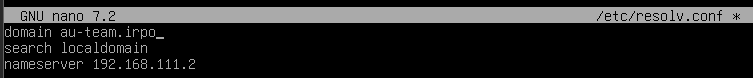
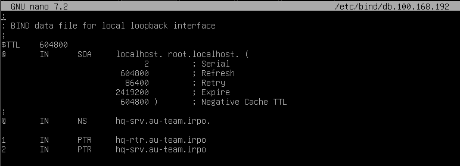
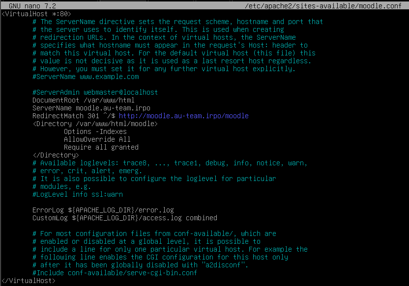
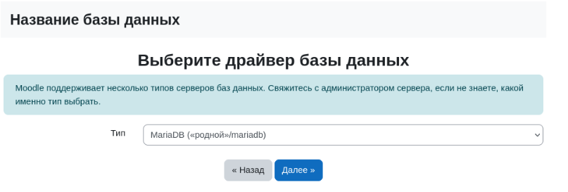
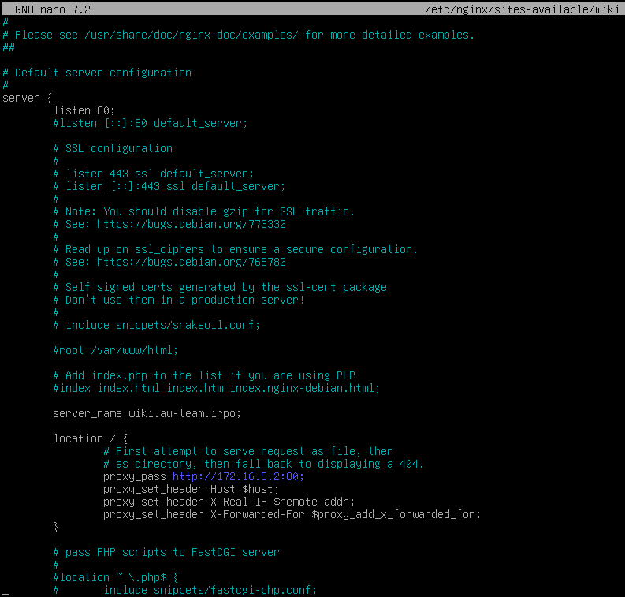

# DEMO2025
Выполнение заданий демонстрационного экзамена специальности 09.02.06


## [МОДУЛЬ 1](#решение-модуль-1)
1. Произведите базовую настройку устройствы
  - [Настройте имена устройств согласно топологии. Используйте полное доменное имя](#конфигурация-доменного-имени-и-имени-устройства)
  - [На всех устройствах необходимо сконфигурировать IPv4](#настройка-ip-адреса)
  - IP-адрес должен быть из приватного диапазона, в случае, если сеть локальная, согласно RFC1918
  - Локальная сеть в сторону HQ-SRV(VLAN100) должна вмещать не более 64 адресов
  - Локальная сеть в сторону HQ-CLI(VLAN200) должна вмещать не более 16 адресов
  - Локальная сеть в сторону BR-SRV должна вмещать не более 32 адресов
  - Локальная сеть для управления(VLAN999) должна вмещать не более 8 адресов
  - Сведения об адресах занесите в отчёт, в качестве примера используйте Таблицу 3
2. Настройка ISP
  - Настройте адресацию на интерфейсах:
      - Интерфейс, подключенный к магистральному провайдеру, получает адрес по DHCP
      - Настройте маршруты по умолчанию там, где это необходимо
      - Интерфейс, к которому подключен HQ-RTR, подключен к сети 172.16.4.0/28
      - Интерфейс, к которому подключен BR-RTR, подключен к сети 172.16.5.0/28
      - [На ISP настройте динамическую сетевую трансляцию в сторону HQ-RTR и BR-RTR для доступа к сети Интернет](#динамическая-трансляция-адресов)
3. [Создание локальных учетных записей](#создание-пользователя)
  - Создайте пользователя sshuser на серверах HQ-SRV и BR-SRV
      - Пароль пользователя sshuser с паролем P@ssw0rd
      - Идентификатор пользователя 1010
      - Пользователь sshuser должен иметь возможность запускать sudo без дополнительной аутентификации.\
  - Создайте пользователя net_admin на маршрутизаторах HQ-RTR и BR-RTR
      - Пароль пользователя net_admin с паролем P@$$word
      - При настройке ОС на базе Linux, запускать sudo без дополнительной аутентификации
4. [Настройте на интерфейсе HQ-RTR в сторону офиса HQ виртуальный коммутатор:](#настройка-vlan)
  - Сервер HQ-SRV должен находиться в ID VLAN 100
  - Клиент HQ-CLI в ID VLAN 200
  - Создайте подсеть управления с ID VLAN 999
  - Основные сведения о настройке коммутатора и выбора реализации разделения на VLAN занесите в отчёт
5. [Настройка безопасного удаленного доступа на серверах HQ-SRV и BRSRV:](#настройка-ssh-сервера)
  - Для подключения используйте порт 2024
  - Разрешите подключения только пользователю sshuser
  - Ограничьте количество попыток входа до двух
  - Настройте баннер «Authorized access only»
6. [Между офисами HQ и BR необходимо сконфигурировать ip туннель](#конфигурация-ip-туннель)
  - Сведения о туннеле занесите в отчёт
  - На выбор технологии GRE
7. [Обеспечьте динамическую маршрутизацию: ресурсы одного офиса должны быть доступны из другого офиса. Для обеспечения динамической маршрутизации используйте link state протокол на ваше усмотрение.](#обеспечение-динамической-маршрутизации)
  - Разрешите выбранный протокол только на интерфейсах в ip туннеле
  - Маршрутизаторы должны делиться маршрутами только друг с другом
  - Обеспечьте защиту выбранного протокола посредством парольной защиты
  - Сведения о настройке и защите протокола занесите в отчёт
8. [Настройка динамической трансляции адресов.](#динамическая-трансляция-адресов)
  - Настройте динамическую трансляцию адресов для обоих офисов.
  - Все устройства в офисах должны иметь доступ к сети Интернет
9. [Настройка протокола динамической конфигурации хостов.](#настройка-протокола-динамической-конфигурации-хостов)
  - Настройте нужную подсеть
  - Для офиса HQ в качестве сервера DHCP выступает маршрутизатор HQ-RTR.
  - Клиентом является машина HQ-CLI.
  - Исключите из выдачи адрес маршрутизатора
  - Адрес шлюза по умолчанию – адрес маршрутизатора HQ-RTR
  - Адрес DNS-сервера для машины HQ-CLI – адрес сервера HQ-SRV
  - DNS-суффикс для офисов HQ – au-team.irpo
  - Сведения о настройке протокола занесите в отчёт
10. [Настройка DNS для офисов HQ и BR](#настройка-dns)
  - Основной DNS-сервер реализован на HQ-SRV.
  - Сервер должен обеспечивать разрешение имён в сетевые адреса устройств и обратно в соответствии с таблицей 2
  - В качестве DNS сервера пересылки используйте любой общедоступный DNS сервер
11. [Настройте часовой пояс на всех устройствах, согласно месту проведения экзамена.](#установка-времени)
## РЕШЕНИЕ МОДУЛЬ 1
### конфигурация доменного имени и имени устройства
Изменяем в файле `/etc/hostname` ```<server-hostname>``` на необходимый хостнейм
В файле `/etc/hosts` меняем строчку ```127.0.1.1 <server-hostname>``` на ```127.0.1.1 <domen> <hostanme>```
Пример: 


В файле `/etc/resolv.conf` меняем строку domain на наш домен. Пример: 


### Сетевая конфигурация
Приватные сети:

От 10.0.0.0 до 10.255.255.255 

От 172.16.0.0 до 172.31.255.255 

От 192.168.0.0 до 192.168.255.255 

### Настройка ip-адреса 

В файле `/etc/network/interfaces` добавляем необходимые записи следующего вида: 

```
allow-hotplug <int>
iface <int> inet static
address <ip>
netmask <mask>
gateway <ip>
```

### Динамическая трансляция адресов

Создаем скрипт по адресу `/etc/iptables.sh`, где WAN - интерфейс в интернет


Далее прописываем ```chmod +x /etc/iptables.sh```

Дописываем в `/etc/network/interfaces` строку ```post-up iptables-restore < /etc/iptables.rules```

запускаем скрипт ```/etc/iptables.sh```

Меняем в файле `/etc/sysctl.conf` значение на ```net.ipv4.ip_forward = 1``` 

Применяем настройку командой ```sysctl -p```

### Настройка VLAN

Устанавливаем пакеты ```vlan bridge-utils```

прописываем ```modprobe 8021q``` и ```echo "8021q" | tee -a /etc/modules```

В `/etc/network/interfaces` добавляем интерфейсы для вланов 
```
auto <vlanname>
iface <vlanname> inet static
address <ip>
netmask <mask>
vlan-raw-device <int>
```

Делаем это на всех машинах участующих в vlan 

### Создание пользователя 
```
useradd -u 1010 -m -s /bin/bash sshuser
echo "sshuser:P@ssw0rd" | chpasswd
```
Добавляем пользователя в группу sudo, чтобы он мог ее использовать 

```usermod -aG sudo sshuser```

С помощью команды `visudo` добавляем строчку для использования sudo без пароля. Возможно понадобится прописать эту же строчку но ниже `%sshuser ... ...`


### Настройка ssh сервера

Установка: ```apt-get install openssh-server```

В файле issue.net меняем текст на необходимый. 

В файле /etc/ssh/sshd_config меняем строчку port на Port <port>


Изменяем эти строчки для максимального кол-ва авторизации и авторизации только для определенных пользователей:


Изменяем эту строчку, добавив путь до файла /etc/issue.net:


### Конфигурация ip туннель

Создаем файл скритпа на 2ух машинах для поднятия gre туннеля ```touch /etc/gre.tun ```

Далее прописываем ```chmod +x /etc/gre.tun```

В файле /etc/gre.tun прописываем следующие:
```
#!/bin/bash
ip tunnel del gre1
ip tunnel add gre1 mode gre remote (ip remote) local (ip local) ttl 255
ip addr add (ip tun remote) peer (ip tun local) dev gre1
ip link set gre1 up 
```
P.S (ip remote = машина на которй дожен быть 2ой туннель) (ip local = машина на который мы проводим настройку)  

Добавляем наш gre туннель в конфигурационные файл (/etc/network/interfaces) на HQ-RTR и BR-RTR

```post-up /etc/gre.tun``` 

### Обеспечение динамической маршрутизации

Качаем пакет ```apt-get install frr```

Меняем строчку ospfd с “no” на “yes” в конфиг файле /etc/frr/daemons

Далее провдим настройку (на двух машинах) frr в файле  /etc/frr/frr.conf 
```
hostname "local hostname"
log syslog informational 
no ipv6 forwarding 
service integrated-vtysh-config
!
router ospf 
 network ip (сеть нашего gre туннеля) area 0.0.0.0
 network ip (сеть подключенного устройства) area 0.0.0.0
!
interface gre1
 ip address (ip gre туннеля у данного локального устройства )
 ip ospf authentication message-digest
 ip ospf message-digest-key 1 md5 root
```
Далее проводим проверку работоспособность (на двух машинах) командой ```vtysh -c "show ip ospf neighbor"```

### Настройка протокола динамической конфигурации хостов

Качаем пакет ```apt-get install isc-dhcp-server``` 

Далее заходим в файл /etc/dhcp/dhcpd.conf
Прописываем:

```
subnet (сеть которая идет к клиенту, пример 192.168.1.0) netmask 255.255.255.240 {
  range (интервал ip адресов, пример 192.168.1.2 192.168.1.14;)
  option routers (сеть gateway, пример 192.168.1.1;)
  option domain-name-servers ( сеть dns, пример 192.168.0.2;
  option domain-name (имя домена "au-team.irpo"); 
}

host (имя устройства пример HQ-RTR) {
  fixed-address ip нашего устройства; 
}
```
Далее меняем конфиг /etc/default/isc-dhcp-server
```
INTERFACESv4= ("интерфейс или же в нашем случае vlan пример vlan200")
INTERFACESv6=""
```
Далее настройка клиента /etc/network/interfaces 
```
auto (название интерфейса или в нашем случае vlan пример, vlan200)
iface vlan200 inet dhcp 
vlan-raw-device (название интерфейса, пример ens33)
```
Проверка работоспособности командой ip a

### Настройка DNS

Установка пакета для разворачивания DNS - сервера: ```apt-get install bind9```

Далее конфигурируем зоны в файле ```/etc/bind/named.conf.local```, добавляя соответствующие записи:

Прямая зона (записи типа А, CNAME)
```
zone "domain" {
  type master; 
  file "<zone file>"; 
};
```
Обраная зона (записи типа PTR)
```
zone "<ip пример: (100.168.192)>.in-addr.arpa" {
  type master;
  file "<zone file>";
}
```
zone file - файл содержащий конфигурацию зоны, создается обычно по пути /etc/bind/<zone>. Для простоты можно скопировать уже существующий файл и изменить его ```cp /etc/bind/db.local /etc/bind/<zone filename>```

Конфигурация сервиса bind9: в файле /etc/bind/named.conf.options


Конфигурация прямой зоны: 


Конфигурация обратных зон:




Проверка:

`named-checkconf`

`named-checkzone <zone> <file>`

### Установка времени 

``` timedatectl set-timezone Europe/Moscow```

## [МОДУЛЬ 2](#решение-модуль-2)

1. Настройте доменный контроллер Samba на машине BR-SRV.
- Создайте 5 пользователей для офиса HQ: имена пользователей формата
user№.hq. Создайте группу hq, введите в эту группу созданных
пользователей
- Введите в домен машину HQ-CLI
- Пользователи группы hq имеют право аутентифицироваться на
клиентском ПК
- Пользователи группы hq должны иметь возможность повышать
привилегии для выполнения ограниченного набора команд: cat, grep, id.
Запускать другие команды с повышенными привилегиями пользователи
группы не имеют права
- Выполните импорт пользователей из файла users.csv. Файл будет
располагаться на виртуальной машине BR-SRV в папке /opt
2. [Сконфигурируйте файловое хранилище:](#конфигурация-хранилища)
- При помощи трёх дополнительных дисков, размером 1Гб каждый, на
HQ-SRV сконфигурируйте дисковый массив уровня 5
- Имя устройства – md0, конфигурация массива размещается в файле
/etc/mdadm.conf
- Обеспечьте автоматическое монтирование в папку /raid5
-Создайте раздел, отформатируйте раздел, в качестве файловой системы
используйте ext4
- Настройте сервер сетевой файловой системы(nfs), в качестве папки
общего доступа выберите /raid5/nfs, доступ для чтения и записи для всей
сети в сторону HQ-CLI
- На HQ-CLI настройте автомонтирование в папку /mnt/nfs
- Основные параметры сервера отметьте в отчёте
3. [Настройте службу сетевого времени на базе сервиса chrony](#настройка-службы-сетевого-времени-на-базе-сервиса-chrony)
- В качестве сервера выступает HQ-RTR
- На HQ-RTR настройте сервер chrony, выберите стратум 5
- В качестве клиентов настройте HQ-SRV, HQ-CLI, BR-RTR, BR-SRV
4. [Сконфигурируйте ansible на сервере BR-SRV](#конфигурирование-ansible-на-сервере-br-srv)
- Сформируйте файл инвентаря, в инвентарь должны входить HQ-SRV,
HQ-CLI, HQ-RTR и BR-RTR
- Рабочий каталог ansible должен располагаться в /etc/ansible
- Все указанные машины должны без предупреждений и ошибок отвечать
pong на команду ping в ansible посланную с BR-SRV
5. [Развертывание приложений в Docker на сервере BR-SRV.](#развертывание-приложений-в-docker-на-сервере-br-srv)
- Создайте в домашней директории пользователя файл wiki.yml для
приложения MediaWiki.
- Средствами docker compose должен создаваться стек контейнеров с
приложением MediaWiki и базой данных.
- Используйте два сервиса
- Основной контейнер MediaWiki должен называться wiki и использовать
образ mediawiki
- Файл LocalSettings.php с корректными настройками должен находиться
в домашней папке пользователя и автоматически монтироваться в образ.
- Контейнер с базой данных должен называться mariadb и использовать
образ mariadb.
- Он должен создавать базу с названием mediawiki, доступную по
стандартному порту, пользователя wiki с паролем WikiP@ssw0rd
должен иметь права доступа к этой базе данных
- MediaWiki должна быть доступна извне через порт 8080.
6. [На маршрутизаторах сконфигурируйте статическую трансляцию портов](#на-маршрутизаторах-сконфигурируйте-статическую-трансляцию-портов)
- Пробросьте порт 80 в порт 8080 на BR-SRV на маршрутизаторе BR-RTR,
для обеспечения работы сервиса wiki
45
- Пробросьте порт 2024 в порт 2024 на HQ-SRV на маршрутизаторе HQRTR
- Пробросьте порт 2024 в порт 2024 на BR-SRV на маршрутизаторе BRRTR
7. [Запустите сервис moodle на сервере HQ-SRV:](#запуск-сервис-moodle-на-сервере-hq-srv)
- Используйте веб-сервер apache
- В качестве системы управления базами данных используйте mariadb
- Создайте базу данных moodledb
- Создайте пользователя moodle с паролем P@ssw0rd и предоставьте ему
права доступа к этой базе данных
- У пользователя admin в системе обучения задайте пароль P@ssw0rd
- На главной странице должен отражаться номер рабочего места в виде
арабской цифры, других подписей делать не надо
- Основные параметры отметьте в отчёте
8. [Настройте веб-сервер nginx как обратный прокси-сервер на HQ-RTR](#настройка-веб-сервер-nginx-как-обратный-прокси-сервер)
- При обращении к HQ-RTR по доменному имени moodle.au-team.irpo
клиента должно перенаправлять на HQ-SRV на стандартный порт, на
сервис moodle
- При обращении к HQ-RTR по доменному имени wiki. au-team.irpo
клиента должно перенаправлять на BR-SRV на порт, на сервис mediwiki
9. Удобным способом установите приложение Яндекс Браузер для
организаций на HQ-CLI
- Установку браузера отметьте в отчёте
## РЕШЕНИЕ МОДУЛЬ 2
### Настройте доменный контроллер Samba на машине BR-SRV

### Конфигурация хранилища

Скачаем пакет apt install mdadm

Проверяем диск командой lsblk

Создаем массив 
```mdadm --create /dev/<название массива> --level=<Версия RAID> --raid-devices=<Количество устройств для массива> /dev/<Диск 1> ... /dev/<Диск n>```

Конфигурация массива размещаем в файле командой 
```mdadm --detail --scan | tee -a /etc/mdadm.conf```

Далее вводим команду ```sudo update-initramfs -u ```

Отфармотировали раздел командой ```mkfs -t ext4 /dev/название массива```

Создаем папку и монтируем раздел туда 
```
mkdir /etc/(название папки,пример raid5)
mount /dev/(название массива) /(название папки)
```

Автомонтируем папку:


Устанавливаем NFS ```apt-get install nfs-kernel-server -y```

Создаем папку ```/(название корневой папки)/nfs```
```
mkdir /(название корневой папки)/nfs
chmod -R 777 /(название корневой папки)/nfs/

```

Настраиваем доступ к папке в файле ```/etc/exports ```
```
/(название паки с массивом)/nfs (сеть к клиенту)(rw,sync,no_subnet_check)

```
Применяем конфигурацию и проверяем доступность.
``` 
  exportfs -arv

  systemctl restart nfs-kernel-server

  exportfs -v
```
### На клиенте:

Установка пакетов на клиенте 
```
apt install nfs-common
```

Создаем папку для монтирования 
```mkdir -p /mnt/nfs```

Редактируем файл ```/etc/fstab```, пишем в конце 
```(сеть сервера):/etc/(название корневой папки)/nfs /mnt/nfs nfs defaults    0     0```

Монтируем 
```
sudo mount -a
sysеtemctl deamon-reload

```
Проверяем на на сервере HQ-SRV 
```echo "Hello, NFS!" | tee /(название корневой папки)/nfs/test.txt```

Проверяем на клиенте  HQ-CLI
```cat /mnt/nfs/test.txt```

### Настройка службы сетевого времени на базе сервиса chrony

(На NTP сервере)Устанавливаем chrony ```apt install chrony```
 
Переходим в конфиг ```/etc/chrony/chrony.conf```

Коментим строчку ```#pool 2.debian.pool.ntp.org iburst```

Далее нииже этой строки пишем:
```
local startum 5
allow (подсети необходимой машины, пример 192.168.100.0/26)
allow (подсети необходимой машины, пример 192.168.200.0/28)
allow (подсети необходимой машины, пример 172.16.5.0/28)
allow (подсети необходимой машины, пример 192.168.2.0/27)
```
После чего перезапускаем сеть ```systemctl restart chrony ```

Производим проверку командой ```chronyc tracking```

Устанавливаем chrony на всех остальных устройствах ```apt install chrony``` 

Далее на всех остальных устройсвах (кроме NTP сервера) меняем кофиг файл ```/etc/chrony/chrony.conf``` следующим образом: 
```
#pool 2.debian.pool.ntp.org iburst
server (Название эталонной машины, пример HQ-RTR) iburst
```
После чего перезапускаем сеть на всех мшинах ```systemctl restart chrony ``` 

Проводим проверку командой ```chronyc tracking``` , где параметр "Stratum" должен быть больше на 1 чем у NTP сервера

Далее проверяем подключение к NPT серверу командой  ```cronyc sources -v```, должно выводить ip адресс нашего NPT сервера с его значением "Stratum"

В случе не корректной работы с отображение клиентов или подситей, на машине где есть эта проблема, в файле ```/etc/iptables.sh``` вводим сторчку ```iptables -t nat -A POSTROUTING -d (Сеть NTP сервера, пример 172.16.4.0/28) -j ACCEPT``` 

Далее на NTP сервере командой ```cronyc clients``` проверяем какие устройства к нему подключенны

### Конфигурирование ansible на сервере BR-SRV

Скачиваенм пакет ansible ```apt install ansible```

Создаем папку ```sudo mkdir -p /etc/ansible```

Создаем нового пользователя на всех устройствах ```adduser ansible```

Если мы на машине прописывали разрешенных пользователей, то туда надо добавить нашего нового пользователя  ```user ansible```

На всех устройставх из задания устанавливаем пакет sshd ```apt install openssh-server```

Далее заходим файл ```/etc/ssh/sshd_config```, раскоментируем строчку "PubkeyAuthentication yes"

Далее на ansible сервере заходим в файл ```/etc/ansible/hosts ```
И прописываем следующие:
```
[routers]
hq-rtr ansible_host=(ip адрес устройства, пример 172.16.4.2) ansible_ssh_port=(номер порта sshd, пример 22) ansible_ssh_user=ansible 
br-rtr ansible_host=(ip адрес устройства, пример 172.16.5.2) ansible_ssh_port=(номер порта sshd, пример 22)ansible_ssh_user=ansible 

[HQ]
hq-srv ansible_host=(номер порта sshd, пример 2024)ansible_ssh_user=ansible
hq-cli ansible_host=(номер порта sshd, пример 22)ansible_ssh_user=ansible
```
Генерируем ssh ключ на ansible сервере ```ssh-keygen```

На сервере ansible прописываем команду ```ssh-copy-id -p (номер порта sshd, пример 22) ansible@(ip адрес машины которую добавляем , пример 172.16.4.2)``` , эту команнду воодим для всех машин которые мы должны добавить 

Проводим проверку работоспособности командой ```ansible all -m ping -i /etc/ansible/hosts```

Пример правельного выполнения задание , после проверки:


### Развертывание приложений в Docker на сервере BR-SRV

Скачиываем пакет ```apt install docker-compose```

Настройки wiki.yml ```nano wiki.yml``` 


Настроиваем через браузер


Перенесем файл туда где установлен наш wiki.yml и изменим эту строку:


Изменение файла wiki.yml


Далее перезапускаем котейнеры 
```
docker-compose -f wiki.yml down
docker-compose -f wiki.yml up -d
```

### На маршрутизаторах сконфигурируйте статическую трансляцию портов

Проброс портов на BR-RTR, заходим и редактируем файл ```/etc/iptables.sh```


Проверяем работоспособность на клиенте, командой ```ssh -p 2024 sshuser@(ip адресс BR-RTR)```

Проброс портов на HQ-RTR, заходим и редактируем файл ```/etc/iptables.sh```


Проверяем работоспособность на клиенте, командой ```ssh -p 2024 sshuser@(ip адресс HQ-RTR)```

### Запуск сервис moodle на сервере HQ-SRV:

Установим все необходимые пакеты 
``` apt-get install apache2 mariadb-server php php-mysql libapache2-mod-php php-xml php-mbstring php-zip php-curl php-gd unzip ```

Создаем бд для moodle


Скачиваем moodle 


Распаковываем файл командой ```unzip <filename>```
Желательно распаковывать сразу в /var/www/html

Меняем права на папке moodle
```
chown -R www-data:www-data /var/www/html/modle
```

Создаем новый кофигурационный файл для апачи 

```touch /etc/apache2/sites-available/moodle.conf```

```cp /etc/appache2/sites-available/000-default.conf /etc/apache2/sites-available/moodle.conf```



Изменим эту настройку по пути `/etc/apache2/apache2.conf`


Активируем сайт на HQ-SRV 
``` a2ensite moodle.conf ```

```systemctl reload apache2 ```

Переходим на сайт и начинаем конфигурацию 


Далее на HQ-SRV вводим команды 
```
mkdir /var/moodledata
chown -R www-data /var/wwww/moodledata
chmod -R 755 /var/www/moodledata
```





Доустанавливаем все необходимые пакеты и поставим разрешения
```apt-get install php-intl```

Так же изменим значение в файле /etc/php/8.2/apache2/php.ini

```max_input_vars = 5000```

### Настройка веб-сервер nginx как обратный прокси-сервер

Настройка для мудла:


Настройка для вики:



Проделать с мудл и вики: 

